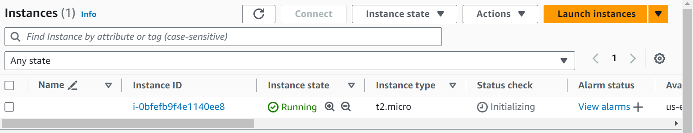

### Terraform manifest skeleton

    Provider_block "provider_name"
    {

    }

    Resource_block
    {

    }


## Resource Syntax
- A resource block declares a resource of a specific type with a specific local name. Terraform uses the name when referring to the resource in the same module, but it has no meaning outside that module's scope.
-----------------
- In the following example, the aws_instance resource type is named web. The resource type and name must be unique within a module because they serve as an identifier for a given resource.

```

resource "aws_instance""web" {
    ami ="ami-a1b2c3d4"
    instance_type = "t2.micro"
 }

```

- Within the block body (between { and }) are the configuration arguments for the resource itself. 
- The arguments often depend on the resource type. 
- In this example, both ami and instance_type are special arguments for the aws_instance resource type.


---------------------------------------------------
# **Basic demo**
- now we are going to create a basic terraform file to start a instance.
- this above code will start a instance in use-east-1 region and  key pair pem file must be in same dir.
- ami id's are unique for each region and diffrent os. So, make sure you copy correct ami id.
- instance type will me t2.micro 

Code ⬇️

```
provider "aws" {
  region = "us-east-1"
}
resource "aws_instance" "my-first-terraform-ins" {
  ami = "ami-0c7217cdde317cfec"
  key_name = "terra-ec2"
  instance_type = "t2.micro"
  # security group
  #no_of instances
  # storage 
  # all these are required to create a instance 
}
```

## Commands
- run **aws configure** and provide access keys for authentication directly
- run **terraform init**  - to initialize the configurations 
- run **terraform validate** - to validate whether any syntax error is present or not.
- run **terraform plan** - to see what resources are going to be created 
- run **terraform apply** - to build the resources 

---------------------
*visit aws ec2 console and check for instance*



-------------------
- run **terraform destroy** command to destroy the resources we created.

-------------------


